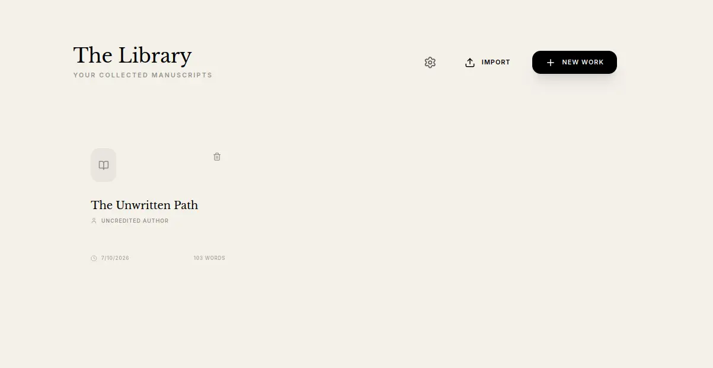
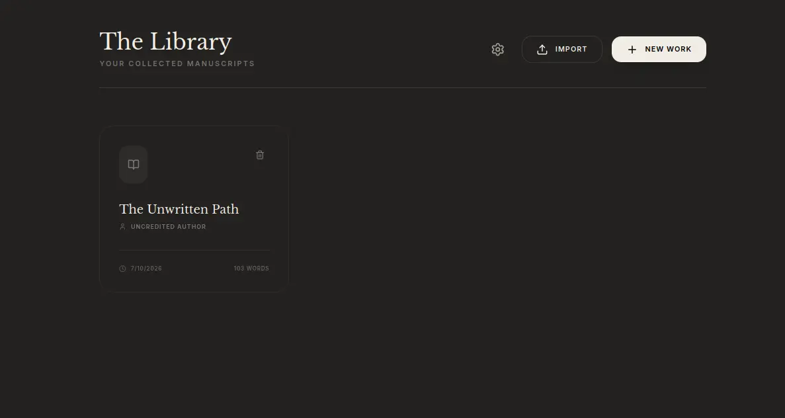
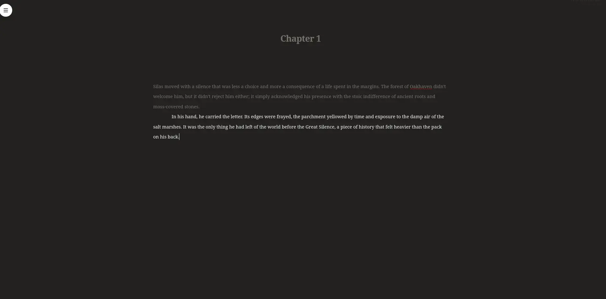
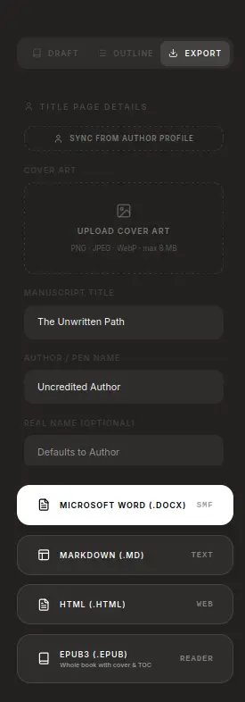

# Chronicle

A minimal, distraction-free writing app for novelists. TipTap-based editor,
multi-manuscript library, optional AI assistance, and a small sync backend
so your work travels between devices.

## Screenshots

**The Library** — your manuscripts, in light and dark mode:

<p align="center">
  
  
</p>

**The writing space** — distraction-free, with focus dimming on the current paragraph:

<p align="center">
  
</p>

**Export** — Standard Manuscript Format `.docx`, Markdown, HTML, or EPUB3 (with cover & table of contents):

<p align="center">
  
</p>

## Quick start (local dev)

```bash
npm install
cp .env.example .env
npm run dev
```

Open <http://localhost:3000>. Data is written to `./data/chronicle.db`.

## Quick start (Docker)

The published image is multi-arch (`linux/amd64` + `linux/arm64`), so it runs
on a normal x86 VPS or a Raspberry Pi. No clone, no build — just drop this into
a `docker-compose.yml`:

```yaml
services:
  chronicle:
    image: ghcr.io/vitadek/chronicle:latest
    container_name: chronicle
    restart: unless-stopped
    ports:
      - "3000:3000"           # -> http://localhost:3000
    volumes:
      - chronicle-data:/data  # manuscripts + SQLite DB live here
    environment:
      - AUTH_MODE=none        # single user, no login. Others: token | forward | oidc

volumes:
  chronicle-data:
```

Then:

```bash
docker compose up -d
```

Open <http://localhost:3000> and start writing. Your work persists in the
`chronicle-data` volume, independent of the container. Update to the latest
build any time with:

```bash
docker compose pull && docker compose up -d
```

Everything beyond the above is optional — see the reference below and
[`.env.example`](./.env.example) for the full commented version, and add
whichever you want under `environment:`.

> **Deploying for real?** See **[DEPLOY.md](./DEPLOY.md)** for a full production
> stack — Caddy (automatic HTTPS) + Authelia forward-auth + Nextcloud hybrid
> storage — with ready-to-edit [`docker-compose.prod.yml`](./docker-compose.prod.yml)
> and [`.env.prod.example`](./.env.prod.example).

## Configuration (environment variables)

Every knob the server reads. All are optional unless noted; defaults shown.
[`.env.example`](./.env.example) has the same list with longer explanations.

### Core

| Variable | Default | Purpose |
|---|---|---|
| `PORT` | `3000` | HTTP port |
| `HOST` | `0.0.0.0` | Bind address |
| `DATA_DIR` | `./data` | SQLite DB + uploads live here (mount a volume) |
| `NODE_ENV` | — | `production` in the published image |

### Auth (`AUTH_MODE` — pick one)

| Variable | Default | Purpose |
|---|---|---|
| `AUTH_MODE` | `none` | `none` \| `token` \| `forward` \| `oidc` |
| `AUTH_TOKEN` | — | mode `token`: shared bearer token every client sends |
| `AUTH_FORWARD_HEADER_USER` | `Remote-User` | mode `forward`: identity headers from your proxy |
| `AUTH_FORWARD_HEADER_EMAIL` | `Remote-Email` | 〃 |
| `AUTH_FORWARD_HEADER_NAME` | `Remote-Name` | 〃 |
| `AUTH_FORWARD_HEADER_GROUPS` | `Remote-Groups` | 〃 |
| `AUTH_FORWARD_TRUSTED_PROXIES` | `loopback,linklocal,uniquelocal` | peers allowed to set those headers (presets or CIDRs) |
| `AUTH_FORWARD_SECRET_HEADER` / `AUTH_FORWARD_SECRET` | — | optional shared-secret check on top of headers |
| `AUTH_FORWARD_ADMIN_GROUP` | — | group name that grants admin |
| `AUTH_OIDC_ISSUER_URL` | — | mode `oidc` (**required**): issuer with discovery |
| `AUTH_OIDC_CLIENT_ID` / `AUTH_OIDC_CLIENT_SECRET` | — | mode `oidc` (**required**) |
| `AUTH_OIDC_REDIRECT_URI` | — | e.g. `https://host/api/auth/oidc/callback` |
| `AUTH_OIDC_SCOPES` | `openid profile email` | |
| `AUTH_OIDC_POST_LOGOUT_REDIRECT_URI` | — | |
| `AUTH_OIDC_TOKEN_AUTH_METHOD` | `auto` | `auto` \| `none` \| `client_secret_basic` \| `client_secret_post` |

### Storage

| Variable | Default | Purpose |
|---|---|---|
| `STORAGE_PROVIDER` | `sqlite` | `sqlite` (everything local) or `hybrid` (local + Nextcloud redundancy) |
| `NEXTCLOUD_URL` | — | hybrid (**required**): your Nextcloud base URL |
| `NC_USER` / `NC_PASS` | — | hybrid (**required**): Nextcloud user + **App Password** |
| `NC_DIR` | `Chronicle_Storage` | hybrid: remote folder for blobs |

### Nextcloud OAuth mirror (optional, separate from hybrid storage)

| Variable | Default | Purpose |
|---|---|---|
| `NEXTCLOUD_CLIENT_ID` / `NEXTCLOUD_CLIENT_SECRET` | — | OAuth app credentials |
| `NEXTCLOUD_REDIRECT_URI` | — | e.g. `https://host/api/auth/nextcloud/callback` |
| `NEXTCLOUD_MIRROR` | `false` | write-behind readable copies of manuscripts |
| `NEXTCLOUD_MIRROR_ROOT` | `Chronicle` | remote folder for the mirror |

### AI (optional — keys stay server-side, never in the browser)

| Variable | Default | Purpose |
|---|---|---|
| `OPENAI_API_KEY` / `ANTHROPIC_API_KEY` / `GEMINI_API_KEY` | — | set any subset; only configured providers are offered in the UI |
| `AI_MODEL` | `gpt-4o` | default text model when the client doesn't pick one |
| `AUDIO_MODEL` | `gpt-4o-mini-tts` | OpenAI TTS for `#!/ai_listen` |
| `AUDIO_VOICE` | `alloy` | TTS voice |
| `AI_UI` | `on` | **`off` (or `false`/`0`/`no`) removes every AI surface from the app** (settings panels, toggles, `#!/ai_*` commands, bubble menu) *and* the server refuses AI API calls with 403 — for purely manual writing setups. Anything else (or unset) keeps AI on |

### Grammar (optional LanguageTool sidecar)

| Variable | Default | Purpose |
|---|---|---|
| `LANGUAGETOOL_URL` | `http://languagetool:8010` | LanguageTool server for grammar checking |
| `LANGUAGETOOL_LANG` | `en-US` | check language |
| `GRAMMAR_AI_MODEL` | `gemini-2.5-flash` | model for AI-assisted grammar suggestions |

### Build from source instead

To build the image yourself (e.g. to hack on it), the repo's
`docker-compose.yml` uses `build: .`:

```bash
git clone https://github.com/Vitadek/chronicle.git
cd chronicle
docker compose up -d --build
```

## Features

- **Multi-manuscript library** — each book has its own metadata, chapter
  list, and cover art.
- **Last-write-wins sync** — write on your laptop, pick up on your phone.
  Per-chapter granularity, so two devices editing different chapters never
  step on each other. See [BACKEND.md](./BACKEND.md) for the protocol.
- **Standard Manuscript Format export** — Shunn-style .docx that agents
  expect. Per-chapter export too.
- **HTML and EPUB3 export** — single-file HTML for sharing, EPUB3 with
  cover image and copyright page for readers.
- **AI assistance (optional)** — review, outline, listen (TTS), and reader
  comments. Reviews never suggest changes — they describe.
- **Plot + Characters outline** — character sheets following the Local
  Script Man Character Map framework, and a simple drag-and-drop plot
  canvas with character lanes and events.
- **Optional Nextcloud integration** — OAuth login plus a write-behind
  WebDAV mirror that puts readable copies of your manuscripts in your
  Nextcloud.
- **Plugins** — install by pasting a git URL; the server compiles them for
  you. See below.
- **Container-first** — one image, one volume, no external services
  required.

## Plugins

Chronicle's bigger features are **plugins**: install what you want, skip what you
don't, and keep the app light. A plugin is just a git repo — paste its URL into
**Settings → Plugins → Install from git** and Chronicle clones and compiles it
server-side. Nothing to build or download by hand.

| Plugin | Install URL |
|---|---|
| **Proofreader** — guided spelling/grammar/AI-clarity pass | `https://github.com/Vitadek/chronicle-plugin-proofreader.git` |
| **Outliner** — plot canvas, character sheets, synopsis, pop-out window | `https://github.com/Vitadek/chronicle-plugin-outliner.git` |
| **Grammar Check** — LanguageTool squiggles + custom dictionary | `https://github.com/Vitadek/chronicle-plugin-grammar-check.git` |
| **Tense Check** — flags narrative tense drift | `https://github.com/Vitadek/chronicle-plugin-tense-check.git` |
| **Autocorrect** — deterministic fixes as you type | `https://github.com/Vitadek/chronicle-plugin-autocorrect.git` |
| **Issues Panel** — every checker finding in one list | `https://github.com/Vitadek/chronicle-plugin-issues-panel.git` |
| **Smart Thesaurus** — selection synonyms, offline-first | `https://github.com/Vitadek/chronicle-plugin-thesaurus.git` |

Plugins **declare what they need**, and Chronicle enforces it — so there's nothing
to set up first:

- Grammar Check, Tense Check and Autocorrect **replace** the built-in versions.
  The built-in stands down on its own (no doubled squiggles) and comes back the
  moment you disable the plugin.
- A plugin needing the LanguageTool sidecar won't enable while it's down — it
  tells you, instead of silently flagging nothing.
- The Issues Panel says *"Limited — no checker"* rather than showing a blank list.

Updates are explicit: **Check for updates** shows you the incoming commits before
you apply them, and you can **pin** a plugin to a commit so nothing shifts
mid-draft.

Writing your own is a `chronicle-plugin.json` and one `.tsx` file — no build
tooling. **[PLUGINS.md](./PLUGINS.md)** has the API, the contribution slots, the
dependency/capability system, and the trust model (plugins run with full
privileges — install only repos you trust).

See [BACKEND.md](./BACKEND.md) for architecture, the sync protocol, and
deployment notes.
